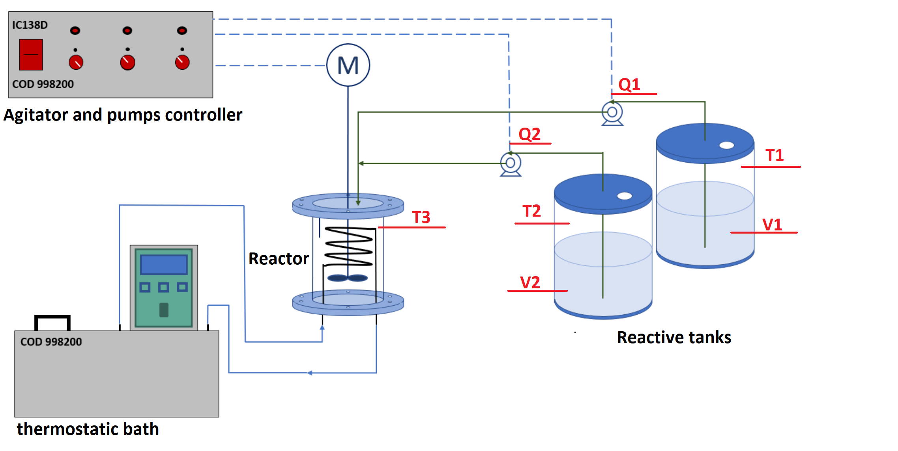
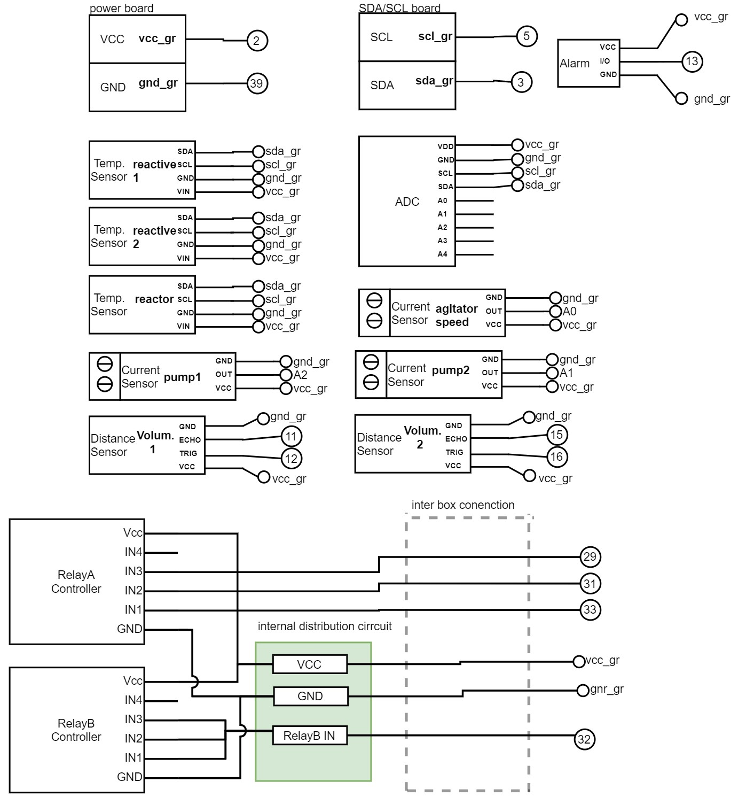
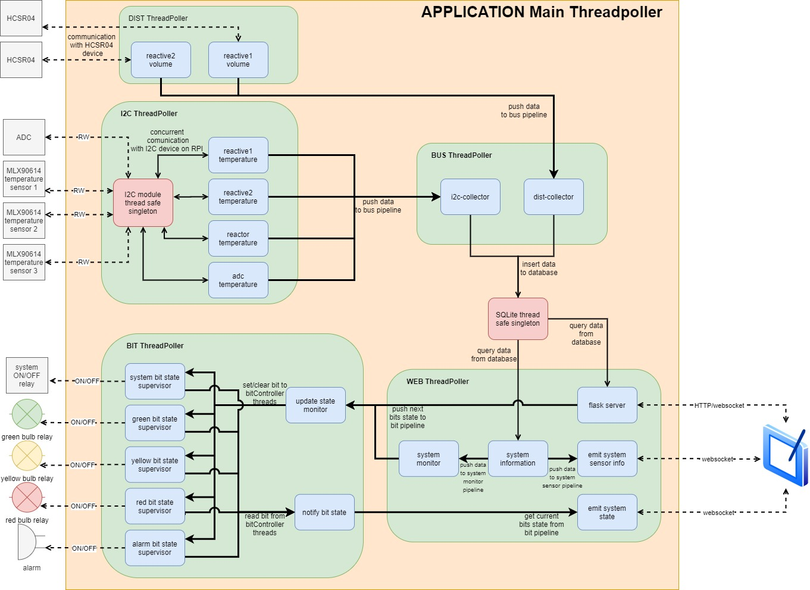
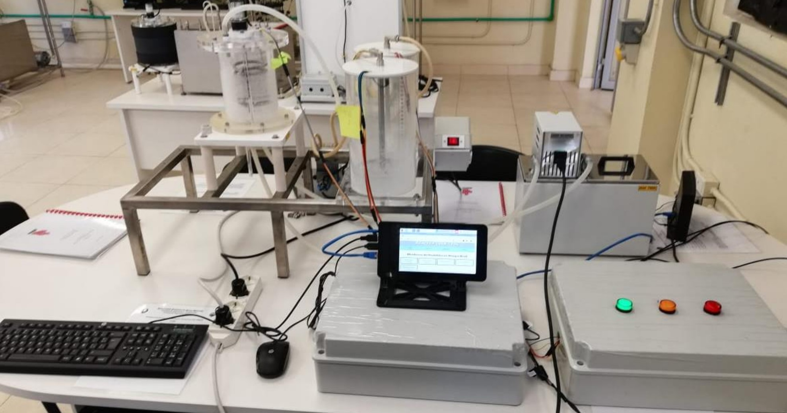
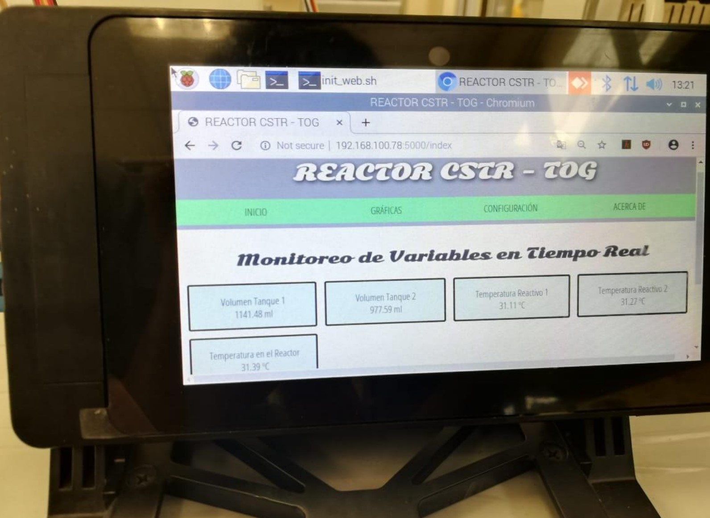

# RPI REACTOR CSTR TOG
## Overview
This repository contains the code for monitor the behaviour of a [Continuous Stirred Tank Reactor (CSTR)](https://en.wikipedia.org/wiki/Continuous_stirred-tank_reactor), in order to alert and disconnect the system for avoiding thermal runaway when an operator is using the machine. 

To accomplish this task, we use an Raspberry Pi 3b+, temperature sensor, distance sensor and develop a local web app for control the system. 

## Project requirements

The operator requirement for secure and monitor the system are: 

- monitor and visualize the state of all physical parameters of system. 
- establish temperature's threshold for stoping the system if its go out of the limits.
- plot all systems physical parameters. 

Below is shown the physical parameters that need to be measure in the system:


- Q1 = reactive 1 flow
- Q2 = reactive 2 flow
- T1 = reactive 1 temperature
- T2 = reactive 2 temperature
- T3 = reactor temperature
- V1 = reactive 1 volume
- V2 = reactive 2 volume

## Electronics connection

For measure those physical variable we use the following sensors:

- HC-SR04: for measure the distance between the sensor and the substance in the reactive for calculing its volume. 
- MLX90614: for measure the temperature of the substance. It use the I2C protocol for communication.
- ACS712: for measure the current of the motor for calculing the flow rate. 
- ADS1115: for multiplexing and converting from analog to digital value. It use the I2C protocol for communication.

Below is shown the electronic diagram of those component connected to the Raspberry. 



## Software design

For performing the measure of each sensor and in the same time handle the request of the local web server hosted in the Raspberry, we decide to design a multi-threaded backend environment in python 3.8. Below is shown the high level design of the application.



Take in note that connections between threads are made by a thread-safe queue implementation. 

In order to share the only I2C internal bus that have the raspberry between all the I2C sensor's thread, we use a singleton thread-safe pattern to allow the use of the bus to one thread at anytime. 

For data storage, we use the in-built python sqlite library with an implementation of singleton thread-safe pattern (because sqlite do not handle concurrent request by its own).

In the pure web server design we use Flask framework with socketio extension for websocket handler and real time update. Finally for plotting the physical values we use the chartjs framework from javascript in the front end. 

## Deployment process

This project was tested in Raspbian GNU/Linux 9 (stretch). 

First install python 3.8 by following the [Linuxize tutorial](https://linuxize.com/post/how-to-install-python-3-8-on-ubuntu-18-04/)

Then, download all necessary dependences and the project repository.

```sh
sudo apt-get update 
sudo apt-get install i2c-tools
git clone https://github.com/en-medina/RPI_REACTOR_CSTR_TOG
cd RPI_REACTOR_CSTR_TOG
```
For preparing the python environment, create a virtual environment and install all dependences. 
```sh
python3.8 -m venv env
env/bin/pip install -r requirements.txt 
```
As there are multiple MLX90614 sensors, it is necessary to change change its I2C address because by default all sensors comes with the 0x5a I2C address. For performing this task use the i2c-tools commands. Below is an example of how we change the address of those devices (for more reference see the [i2c config file](app/i2c_service/config.json)). 
```sh
#Find your I2C bus in your linux with the command i2cdetect -l 
#(in my case is the i2c-1)
i2cdetect -l
i2c-1   i2c             bcm2835 I2C adapter                     I2C adapter

#Write the word 0x0000 to the address 0x2E and append the PEC check byte.
i2cset -y 1 0x5a 0x2E 0x0000 wp 

#Write the new address as a word, to the address 0x2E and append the PEC 
#check byte. In my case the new address is 0x005c
i2cset -y 1 0x5a 0x2E 0x005c wp

#Perform a power cycle of the MLX90614 device
#Check the new address with the command i2cdetect -y 1
i2cdetect -y 1
```
Before running the application consider to see the [i2c config file](app/i2c_service/config.json), [bit config file](app/bit_service/config.json) and [dist config file](app/dist_service/config.json) in order to map all sensors and actuator pin connector and/or address. 

Finally for running the application run the following command:
```sh
env/bin/python app.py
```
Take in note that app.py use relative path to access its internal file, so we need to execute the script at its current directory location. 

## Team

This project was made by [Enmanuel Medina](https://www.linkedin.com/in/enmedina3/), [Otoniel Lara](www.linkedin.com/in/otoniells), [Taimi Pérez](https://www.linkedin.com/in/taimipt/) and [Gerald Castillo](https://www.linkedin.com/in/gerald-castillo-726613166/).

Here is the final result:

